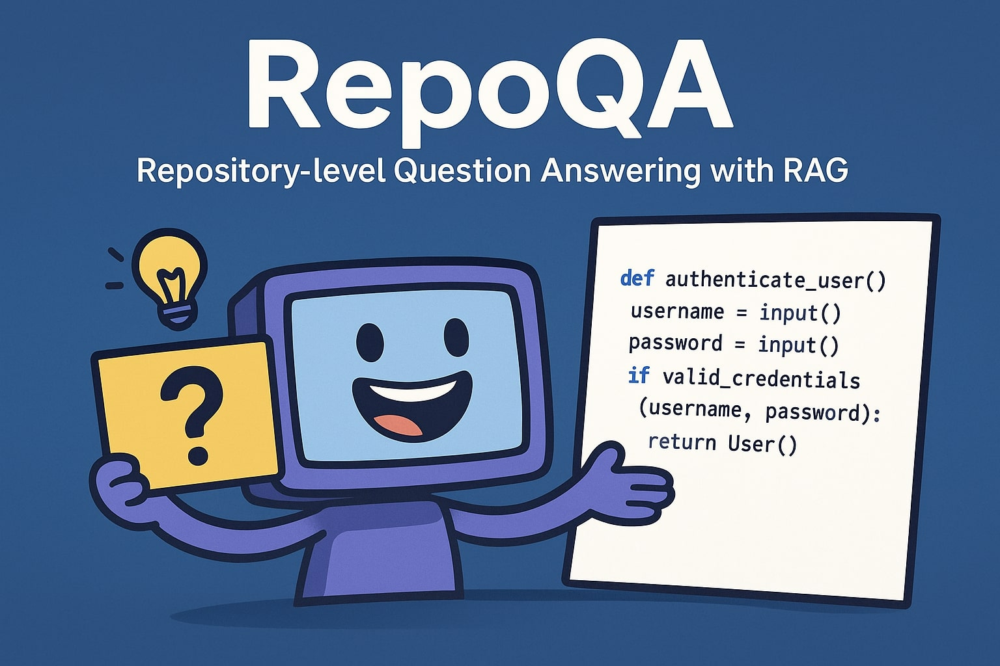

# RepoQA: Repository-level Question Answering with RAG

[](https://opensource.org/licenses/MIT)
[](https://www.python.org/downloads/)
[](https://hub.docker.com/r/afifaniks/repoqa)
[](https://hub.docker.com/r/afifaniks/repoqa)
[](https://hub.docker.com/r/afifaniks/repoqa)
[](https://codecov.io/github/afifaniks/repoqa)


<small><i>Image generated with ChatGPT</i></small>

RepoQA is a software **repository-level question answering system** powered by **Retrieval-Augmented Generation (RAG)** and a **Large Language Model (LLM)**.  
It allows users to ask natural language questions about a software repository and receive context-aware answers grounded in the repository’s code and documentation.

## Features
- **Repository-level Question Answering**: Ask questions about functions, classes, modules, or overall repository design.
- **Retrieval-Augmented Generation (RAG)**: Combines semantic retrieval with generative reasoning for precise and grounded answers.
- **Code-Aware Retrieval**: Extracts relevant files, functions, and comments from the repository to provide evidence-based responses.
- **LLM Integration**: Uses a large language model to generate human-like, context-rich answers.

## Architecture
1. **Indexing**:  
   - The repository codebase is parsed and embedded using a code-aware embedding model.  
   - Metadata (file paths, function definitions, docstrings) is stored in a vector database.

2. **Query Processing**:  
   - User provides a natural language query.  
   - The system retrieves the most relevant code snippets/files using semantic similarity search.  

3. **Answer Generation**:  
   - The retrieved context is passed into an LLM with the user's question.  
   - The LLM generates a grounded and contextually accurate answer.  

## Quick Start with Docker

The easiest way to get started with RepoQA is using Docker:

### Prerequisites
- Docker or Podman installed
- NVIDIA GPU (optional, but recommended for better performance)
- NVIDIA Container Toolkit (for GPU support)

### Pull and Run

```bash
# Pull the image from Docker Hub
docker pull afifaniks/repoqa:latest

# Run with GPU support (Docker with NVIDIA Container Toolkit)
docker run --gpus all \
  -v $(pwd)/ollama_data:/root/.ollama \
  -p 8000:8000 \
  afifaniks/repoqa:latest

# Run with GPU support (Podman with CDI)
podman run --device nvidia.com/gpu=all \
  -v $(pwd)/ollama_data:/root/.ollama \
  -p 8000:8000 \
  afifaniks/repoqa:latest

# Or run without GPU (Docker)
docker run \
  -v $(pwd)/ollama_data:/root/.ollama \
  -p 8000:8000 \
  afifaniks/repoqa:latest

# Or run without GPU (Podman)
podman run \
  -v $(pwd)/ollama_data:/root/.ollama \
  -p 8000:8000 \
  afifaniks/repoqa:latest
```

**GPU Support Notes:**
- **Docker**: Requires [NVIDIA Container Toolkit](https://docs.nvidia.com/datacenter/cloud-native/container-toolkit/install-guide.html) and uses `--gpus all` flag
- **Podman**: Uses CDI (Container Device Interface) with `--device nvidia.com/gpu=all` flag
- GPU support significantly improves LLM inference performance

The API will be available at `http://localhost:8000`. Visit `http://localhost:8000/docs` for the interactive API documentation.

### Using the API

Once the container is running, you can ask questions about repositories:

```bash
# Ask a question about a repository
curl -X POST http://localhost:8000/ask \
  -H "Content-Type: application/json" \
  -d '{
    "repo": "https://github.com/afifaniks/repoqa.git",
    "question": "How does this application work?",
    "llm_model": "qwen3:1.7b"
  }'
```


### Building from Source

If you want to build the Docker image yourself:

```bash
# Clone the repository
git clone https://github.com/afifaniks/repo-qa.git
cd repo-qa

# Build with Docker
docker build -t repoqa .

# Build with Podman
podman build -t repoqa .
```

**Running the Built Image:**

```bash
# Docker with GPU support (requires NVIDIA Container Toolkit)
docker run --gpus all \
  -v $(pwd)/ollama_data:/root/.ollama \
  -p 8000:8000 \
  repoqa

# Docker without GPU
docker run \
  -v $(pwd)/ollama_data:/root/.ollama \
  -p 8000:8000 \
  repoqa

# Podman with GPU support (uses CDI)
podman run --device nvidia.com/gpu=all \
  -v $(pwd)/ollama_data:/root/.ollama \
  -p 8000:8000 \
  repoqa

# Podman without GPU
podman run \
  -v $(pwd)/ollama_data:/root/.ollama \
  -p 8000:8000 \
  repoqa
```

### Docker Compose

For easier management, use docker-compose:

```bash
# Start the service
docker-compose up

# With custom settings
REPO_PATH="https://github.com/your-repo.git" \
QUESTION="Your question here" \
docker-compose up
```

## Contributing

We welcome contributions! Please see our [Contributing Guide](CONTRIBUTING.md) for details on:

- How to set up the development environment
- Our coding standards and style guide
- How to submit changes and report bugs
- Where to ask for help

To see the current status of the project, please have a look at [RepoQA Kanban Board](https://github.com/users/afifaniks/projects/9/).

### Quick Start for Contributors

```bash
# Clone your fork
git clone https://github.com/<your-username>/repoqa.git
cd repoqa

# Set up development environment
make setup

# Run tests to verify everything works
make test

# See all available commands
make help
```

## License

This project is licensed under the MIT License - see the [LICENSE](LICENSE) file for details.

### OSS Component Usage Policy

All dependencies are checked for license compatibility. See our:
- [NOTICE](NOTICE) file for third-party attributions  
- [OSS Component Usage Policy](CONTRIBUTING.md#oss-component-usage-policy) for contribution guidelines
- [License Policy Quick Reference](docs/license-policy.md) for allowed/prohibited licenses

## Generative AI Usage
GitHub Copilot with Claude Sonnet 4 was used to generate boilerplates, documentation, test cases for this project. However, all the generated contents were manually validated.